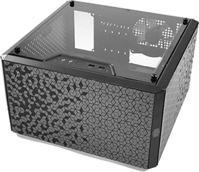

# CasaEsperta - Main Server

## Hardware

* AMD Ryzen 3 2200G Quad-Core 3.5GHz
* Micro-ATX MSI B350M PRO-VDH
* G.SKILL Ripjaws V 16GB DDR4-3200MHz CL16
* WD Green 120GB M.2 SATA
* 4 x WD Red 4TB in ZFS RAIDZ-1

## Software
* Linux Ubuntu Server 20.04
* [SSH](#enable-ssh)
* [Samba](#share-folders-with-samba)
* [Docker & Docker Compose](#docker)
* [Containers](docker_containers.md)
* [Shinobi](shinobi.md)

TODO #3
## How does it work
I'll explain more or less how all of whis works together.

Traefik handles automatically the reverse proxy and SSL certificates side of things. 

The "external" authentication is handled by Google authentication, where the Google accounts you permitted will be able to login with their Google accounts and have access to your services. Some of the services have another authentication layer in front of them, but only valid Google accounts will be able to get there.

There's a main frontpage, exposed at https://example.pt by [Organizr](organizr.md). Its [main page](../images/organizr.png) have my server and Raspberry Pis system dashboard so I can have an overview of the state of those machines. It has some admin services on the side bar, like Dozzle, Filerun and Portainer and [Heidall](../images/heimdall.png) as well, as a page to explose the remainder of my services.

I use InfluxDb and grafana to store sensor data and visualize it.

Guacamole is mostly used to access remotely to my servers without exposing my ports.

If I ever need to browse my data files or share a video with someone, I can do it with Filerun on the go.

Sonarr and Radarr are used to manage what TV Shows and Movies I want and use Jackett's indexers to send download requests to qBittorrent. With Plex Media Server I can then watch what's stored in the server.

## Guide
This guide assumes there's a clean Ubuntu Server 20.04 install, but it might also work with other Ubuntu based versions, clean or not. It also assumes that there's a Windows 10 client machine to SSH from and to access samba shares.

It is also based on the fact that there's a Cloudflare registered domain. In the guide, `example.pt` will be used as that domain. There will be some alternative paths if you prefer to use the free DDNS service [DuckDNS](http://www.duckdns.org/)

### Initial server configuration
```
sudo apt update && sudo apt upgrade -y && sudo apt autoremove -y
```
In case you haven't setup the right hostname while instaling, do it now:
```
sudo hostname Wanted_Hostname
```
Set your Timezone:
```
sudo timedatectl set-timezone Europe/Lisbon
```
And setup a local [NTP server](https://linuxconfig.org/ubuntu-20-04-ntp-server):
```
sudo apt install ntp
sudo nano /etc/ntp.conf
```
Replace
```
pool 0.ubuntu.pool.ntp.org iburst
pool 1.ubuntu.pool.ntp.org iburst
pool 2.ubuntu.pool.ntp.org iburst
pool 3.ubuntu.pool.ntp.org iburst
```
with
```
server 0.europe.pool.ntp.org
server 1.europe.pool.ntp.org
server 2.europe.pool.ntp.org
server 3.europe.pool.ntp.org
```
Save and restart ntp service:
```
sudo systemctl restart ntp
```

#### Terminal Aliases
A useful thing to have are aliases of usual commands you use. There are some common ones for this guide included in [aliases](../main_server/aliases) file. To set them up, append the content of the file to your .bashrc file:
```
nano ~/.bashrc
```
Update your environment:
```
source ~/.bashrc
```
The rest of the guide will use aliases instead of full commands. Use [aliases](../main_server/aliases) to look them up if you didn't want to set them up.

#### Enable [SSH](https://linuxconfig.org/ubuntu-20-04-ssh-server)
```
aptupd
sudo apt install openssh-server -y
sudo systemctl status ssh
```
If it's not running do
```
sudo systemctl enable ssh
sudo systemctl start ssh
```
If you don't want to use password everytime you want to SSH into the server, on your client machine, generate a private key and copy it to the server:
```
ssh-keygen -t rsa rsa -b 2048
ssh-copy-id USERNAME@HOSTNAME
```

#### Import [ZFS](https://openzfs.github.io/openzfs-docs/Getting%20Started/Ubuntu/index.html) pool
This section assumes that there's a ZFS pool attached to the server, that wasn't imported yet.
It also assumes that the files on the pool belong to a certain GROUP represented by GROUP_ID.
```
sudo apt install zfsutils-linux -y
sudo zpool import -f NAME_OF_POOL
```
Create the group and add your user to it
```
sudo groupadd -g GROUP_ID GROUP
sudo usermod -aG GROUP ${USER}
```

#### External Drive
I have an external USB 3.0 drive attached all the time, used to store CCTV recordings.
```
sudo mkdir /mnt/External
sudo chown -R USER:GROUP /mnt/External
sudo nano /etc/fstab
```
Append this to the file, using the right UUID for the drive
```
UUID=f6bf7a9f-024f-d501-f0ba-5a9f024fd501 /mnt/External   ext4    defaults,auto,users,rw,nofail 0 0
```
And mount it:
```
sudo mount -a
```

#### Share folders with [Samba](https://linuxconfig.org/how-to-configure-samba-server-share-on-ubuntu-20-04-focal-fossa-linux)
```
sudo apt install samba -y
sudo cp /etc/samba/smb.conf /etc/samba/smb.conf_backup
```
Clean all the comments from the file
```
sudo bash -c 'grep -v -E "^#|^;" /etc/samba/smb.conf_backup | grep . > /etc/samba/smb.conf'
```
Add your user to Samba users
```
sudo smbpasswd -a ${USER}
```
Optionally, you can add another samba-only user that have rights on the ZFS pool files and shares
```
sudo useradd -M USER
sudo smbpasswd -a USER
sudo usermod -aG GROUP USER
```

### Docker
This installation is heavily inspired in [this guide](https://www.smarthomebeginner.com/traefik-2-docker-tutorial/#Docker_Configuration), so I recommend to read it at least one time before continuing.
```
sudo apt install docker.io -y
sudo apt install docker-compose -y
sudo systemctl enable --now docker
```
Configure the folder that will store our containers data and configurations:
```
mkdir ~/docker
sudo apt install acl -y
sudo setfacl -Rdm g:docker:rwx ~/docker
sudo chmod -R 775 ~/docker
```
Add your user to the docker group and re-log for the changes to take effect:
```
sudo usermod -aG docker ${USER}
exit
```

#### .env file
Docker compose can take advantage of using a .env file, where you can store some key-value pairs that represent some variables on the compose file.
There's an example file with all the configurations needed for the final compose [here](../main_server/docker/env_example).

Copy it to `~/docker/.env` on your server.

Use the command `id` to get your user's and docker group's Ids. Now replace some of the values in the `.env` file:
```
# your user id
PUID=
# docker group id
PGID=
TZ=Europe/Lisbon

# Home folder
USERDIR=/home/USERNAME
DOCKERDIR=/home/USERNAME/docker
```

### [Containers](docker_containers.md)

### [Shinobi](shinobi.md)